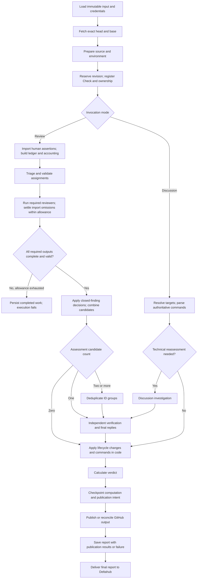

# AI review worker specification

Status: agreed POC specification and v0.1 implementation contracts. The worker is not implemented yet.

## Purpose and scope

The worker reviews a GitHub PR against Jira requirements, technical correctness, prior findings, and project-specific rules. It produces evidence-backed findings, a commit-specific verdict, GitHub discussions, and a durable JSON report.

The POC is complete only when the main review, follow-up, discussion, publication, and recovery capabilities below work together. Implementation can be staged; a single-agent happy path alone does not complete the POC.

The application is private to the organization. Repositories are mirrored into its GitHub organization; customers do not access these mirrors. GitHub discussions may include internal business context. PR files are exported to customers, so internal references in those files are subject to review. Export squashes commits and replaces commit messages; commit-message cleanup is not a worker responsibility.

Repositories are not tied to a framework. Most are Python projects, commonly Scrapy, Django, or FastAPI. Fork PRs are excluded from the POC. Stacked PRs are supported.

## Ownership

| Worker, this repository | Deltahub, outside this repository |
| --- | --- |
| Load and validate the supplied review input | Decide whether and when a PR is eligible |
| Fetch exact commits and prepare the environment | Resolve Jira tickets and PRs |
| Run triage, reviewers, deduplication, verification, and discussion | Receive Jira/GitHub events and schedule jobs |
| Read allowed related context and attachments | Store account credentials and own Codex OAuth renewal |
| Publish GitHub Checks and review comments | Enforce customer-export gates and manual overrides |
| Persist artifacts and send ordered progress/results | Schedule later retries and reviews of newer inputs |

Deltahub API behavior described in the contracts is an integration requirement, not an instruction to implement its backend here.

## Non-negotiable properties

1. Review a fixed GitHub repository, PR, head commit, and base commit. Record the merge base used for the PR diff. Never pull newer changes into an active review.
2. Approval for one review input cannot satisfy a gate for another input, including a newer head or a changed base with the same head.
3. All required reviewers must return successful, schema-valid results before deduplication or verification starts. An empty findings array is a successful result; a missing output is not.
4. Every candidate that will be published must pass through a completed verifier assessment. An assessment may be valid, invalid, or unverifiable. Runtime failure is not an unverifiable assessment.
5. A required agent that cannot complete after retries causes execution failure and no new review verdict. Preserve completed stage outputs.
6. Publish completed reviews against the commit actually reviewed even if the PR has advanced. New commits do not cancel the historical result.
7. All agents execute within one Cloud Run Job task/instance for the POC. Separate workspaces prevent ordinary local-file interference.
8. Use the user's Codex subscription, initially the owner's Business account. API-key billing is not a fallback. Subscription-authentication applicability is outside this specification’s scope.
9. Do not rerun CI suites, formatters, or linters. Focused reproductions are allowed.
10. Execute against local or explicitly designated development resources only. Staging and production are excluded.

## Supported use cases

### First review

Load the immutable payload and credential references; fetch the exact Git revisions; prepare the project; import unprocessed human assertions and build the history ledger; triage and assign review work; await all required reviewers, settling sourced human-import omissions through bounded correction; apply closed-finding decisions and seed required history alongside new findings; deduplicate when required; independently verify candidates and compose final replies; derive prior-finding actions and calculate the verdict in code; checkpoint computation; publish to GitHub; save the report with publication results (or failure details); update Deltahub.

Setup failure does not by itself fail a review when source remains readable. Continue with inspection, record the limitation, and identify individual findings that cannot be verified without execution. Missing access to the code or an exact required revision is an execution failure.

### Follow-up review

Use a previous completed review as the baseline. Keep the request’s authoritative requirement snapshot fixed; record and notify Deltahub of any observed changes for a new request. Focus on subsequent changes and unresolved findings, retaining the complete current PR diff as reference. A missed issue in unchanged PR-introduced code may still be raised and block by severity. Review dismissals and discussion history as well as code. The quality owner explicitly retains or selects each closed finding for reassessment; reopening requires independent evidence of relevant changed circumstances.

If the previous review failed, the changed input can receive a first review. If rewritten history or retargeting makes incremental comparison unreliable, perform a fresh review and record the reason. A completed review remains a usable baseline even if the PR advanced before it was published. Falling back to a full code comparison does not erase known finding identities, human dismissals, or discussion history; reconcile those independently of whether the old diff is usable.

### Discussion without new code

Assess new replies to existing findings using the same investigation capabilities as a reviewer. A disagreement from any human is investigated by a discussion agent and independently verified before changing a technical finding state. The verifier also composes final replies; code applies lifecycle changes, with no third reconciliation agent in discussion mode. The worker derives targets from triggering comments, commands, thread associations and optional validated finding IDs. A valid `@<configured-handle> /dismiss <finding-id>` command from a non-author human is an authoritative per-finding override processed by application code without model approval. Publish replies for AI-originated findings, revise finding states, and recalculate the verdict for the reviewed head/base. Preserve previous report revisions.

Discussion can approve an existing reviewed version after its blocking findings are settled. A finding may be marked fixed only if the fix is verified in the exact snapshot; a newer fix requires a follow-up code review. It cannot approve newer code. The worker does not poll GitHub indefinitely or decide when discussion jobs should be triggered.

### Stacked PR

If PR2 targets PR1, review only PR2's changes relative to its target. PR1 code is context. Do not report PR1-only problems on PR2, including as unrelated findings. Deltahub requires a fresh review when the relevant base changes.

### Unrelated defect

A defect already present outside the PR may be reported as unrelated and placed in its own overview section. It never blocks this PR, regardless of severity. The stacked-PR exclusion above takes precedence.

### Interrupted execution or delivery

Deltahub creates a new linked job record for a later retry, retaining the same `request_id` and payload generation only when review inputs are identical. Cloud Run task retries are disabled. On that retry, reuse validated, durably saved completed stages. Restart unfinished stages from saved inputs; restoring an agent midway through its conversation is not a POC requirement. Delivery retries reuse the completed computation from its checkpoints or saved report and reconcile previously published GitHub objects.

## Review outcome

A completed review requires changes if it has at least one **open, PR-related, major or blocking finding whose verification is valid or unverifiable**. Otherwise it is approved. Fixed, explicitly dismissed, invalid, and unrelated findings do not block. Count canonical findings, not each duplicate source independently.

A failure before required computation completes has a null review verdict. GitHub may display an operational failure Check without asserting that the code requires changes. A delivery failure after review completion retains the computed verdict and separately records delivery status.

## Flow

Required import, verifier or discussion failures use the same bounded failure/retry behavior as other required agents. Independent role timeouts pause only for explicit quota waiting; all work/wait/retries still count against the overall deadline. Persist completed stages and publication progress incrementally, including before any stop signal. Delivery failure preserves the computed verdict, and a later delivery-only update creates another immutable report revision.

Deltahub cancel removes a job before it starts; stop requests graceful termination after start. If the worker disappears, Deltahub uses the execution outcome and recorded stop intent to distinguish failure from intentional stop. Failures may receive a linked retry; intentional stops do not retry automatically. For an authorized retry, the retry worker determines remaining work from checkpoints. Deltahub may close an abandoned running Check but does not interpret review findings to recover it.

## Defaults

| Setting | POC default |
| --- | --- |
| Maximum reviewers selected by triage | 4 |
| Concurrent agent sessions in an instance | 2 |
| Additional attempts for a failed agent stage | 2, for 3 total attempts |
| Cumulative subscription-limit waiting per execution | 30 minutes |
| Total worker execution deadline | 2 hours |
| Cloud Run task automatic retries | 0 |
| Per-agent-attempt timeouts by role | Positive deployment-configured durations; illustrative examples only |

These are configurable defaults, not platform limits or throughput guarantees. Expected initial traffic is fewer than approximately 5–10 reviews a day. Runtime/version compatibility and the account's actual quota must be measured.

## Completion criteria

The POC must demonstrate the scenarios in [acceptance.md](acceptance.md), including discussion-only verdict changes, stacked PRs, older-commit publication, recovery from saved stages, and no approval when a required stage fails. Schemas and examples alone do not establish SDK or Cloud Run compatibility.
